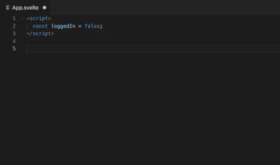

# Svelte 3 Snippets for VS Code

Visual Studio Code Extension that adds Svelte 3 snippets to your favorite IDE.

All code snippets are based on and follow the official Svelte documentation.

Available for [VSCodium](https://vscodium.com/) at [Svelte 3 Snippets](https://open-vsx.org/extension/fivethree/vscode-svelte-snippets).

## Using Snippets in VS Code

Type part of a snippet, press `Enter`, and the snippet unfolds.

# Contributing

Contributions are welcome! See [Contribution Guidelines](CONTRIBUTING.md) to get started.

# Snippets Documentation

| Prefix | Description     |
| ------ | --------------- |
| `s-`   | Svelte Snippets |

<!-- Auto Generated Below -->

# Table of Content

- [Snippets Documentation](#snippets-documentation)
  - [Svelte](#svelte)
  - [Javascript](#javascript)
  - [Css](#css)

## Svelte

| Prefix                 | Description                                            |
| ---------------------- | ------------------------------------------------------ |
| s-component-format     | add a script to your svelte file                       |
| s-script               | add a script to your svelte file                       |
| s-script-context       | add a script with context="module" to your svelte file |
| s-style                | add styles to your svelte file                         |
| s-expression           | basic expression                                       |
| s-expression-html      | html content expression                                |
| s-expression-debug     | html content expression                                |
| s-if-block             | if block                                               |
| s-if-else-block        | if else block                                          |
| s-else-block           | else block                                             |
| s-if-else-if-block     | if else if block                                       |
| s-else-if-block        | else if block                                          |
| s-each-block           | each block                                             |
| s-each-else-block      | each else block                                        |
| s-each-index-block     | each index block                                       |
| s-each-key-block       | each index block                                       |
| s-each-index-key-block | each index key block                                   |
| s-await-then-block     | await then block                                       |
| s-then-block           | then block                                             |
| s-await-short-block    | await short block                                      |
| s-await-catch-block    | await catch block                                      |
| s-catch-block          | catch block                                            |
| s-on-event             | on event                                               |
| s-on-event-foward      | on event foward                                        |
| s-on-event-modifiers   | on event w/ modifiers                                  |
| s-on-event-inline      | on event inline                                        |
| s-modifier             | modifier                                               |
| s-bind                 | bind property                                          |
| s-bind-property        | bind property                                          |
| s-bind-video           | bind property                                          |
| s-bind-block-level     | bind property                                          |
| s-bind-group           | bind group                                             |
| s-bind-this            | bind this                                              |
| s-class                | class                                                  |
| s-class-short          | class shorthand                                        |
| s-use                  | use action                                             |
| s-use-parameters       | use action w/ parameters                               |
| s-transition           | transition                                             |
| s-transition-params    | transition-params                                      |
| s-transition-events    | transition-events                                      |
| s-transition-local     | transition local                                       |
| s-transition-all       | transition                                             |
| s-animate              | animate                                                |
| s-slot                 | slot                                                   |
| s-slot-name            | slot w/ name                                           |
| s-slot-prop            | slot w/ prop                                           |
| s-self                 | svelte:self                                            |
| s-self-prop            | svelte:self                                            |
| s-component            | svelte:component                                       |
| s-window               | svelte:window                                          |
| s-window-bind          | svelte:window bind properties                          |
| s-body                 | svelte:body                                            |
| s-head                 | svelte:head                                            |
| s-options              | svelte:options                                         |

## Javascript

| Prefix                    | Description                             |
| ------------------------- | --------------------------------------- |
| s-create-component        | svelte create component                 |
| s-reactive-statement      | reactive statement                      |
| s-reactive-block          | reactive block                          |
| s-action                  | action function                         |
| s-action-parameters       | action function                         |
| s-action-update           | action w/ update function               |
| s-lifecycle-mount         | onMount lifecycle function              |
| s-lifecycle-before-update | beforeUpdate lifecycle function         |
| s-lifecycle-after-update  | afterUpdate lifecycle function          |
| s-lifecycle-destroy       | onDestroy lifecycle function            |
| s-tick                    | svelte tick function                    |
| s-set-content             | svelte setContext                       |
| s-get-content             | svelte getContext                       |
| s-dispatch                | svelte dispatch                         |
| s-dispatch-event          | svelte dispatch event                   |
| s-writeable               | svelte writeable                        |
| s-writeable-set           | svelte writeable w/ set function        |
| s-readable                | svelte readable (set function required) |
| s-derived                 | svelte derived store                    |
| s-derived-multiple        | svelte derived store                    |
| s-derived-set             | svelte derived store                    |
| s-derived-multiple-set    | svelte derived store                    |
| s-store-get-value         | svelte get value from store             |
| s-component-set           | svelte component api \$set              |
| s-component-on            | svelte component api \$on               |
| s-component-destroy       | svelte component api \$destroy          |
| s-render-component        | svelte render component                 |
| s-tweened                 | svelte create tweened store             |
| s-spring                  | svelte create spring store              |
| s-register                | svelte register                         |

## Css

| Prefix         | Description                         |
| -------------- | ----------------------------------- |
| s-global-style | add global styles to your style tag |

**[⬆ back to top](#table-of-content)**
